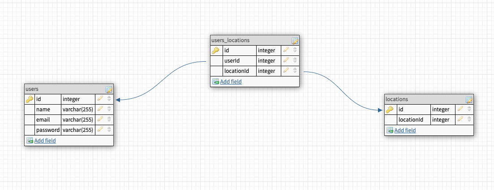

# Weather App

## Full-stack application? Count me in!

## Pre-setup

- We are going to be implementing a third party api too!
- sign up for an account here (its free) https://home.openweathermap.org/users/sign_up
- Once you've signed up, you're given an API key. Copy that API key and keep track of it somewhere!
- Open Postman to check out the data you're working with & to verify that your key works. Make a GET request to the following URL in postman, adding your API key to the end.
- Read the API documentation carefully, to make sure you know how to make each request! https://openweathermap.org/current

## Setup

- cd into each folder respectively (frontend and backend) and run `npm i -y` in each of them

  - then INSIDE the BACKEND folder `npm i axios cors express pg rowdy-logger sequelize`
  - then cd .. out of the backend folder and cd into the frontend folder
  - INSIDE of the FRONTEND folder `npm i express path rowdy-logger`

  - once you are done installing your dependencies for both frontend and backend adjust the scripts in both of them adding this
    - <pre><code>
      "start": "node server.js",
      "dev": "nodemon server.js"
      </code></pre>

- now lets create our backend setup
- sequelize init
- adjust your config/config.json
- create your database and call it 'weather'
- in your backend folder, look at this erb and create your models accordingly
  
  - to create your models remember table name should be SINGULAR
  - `sequelize model:generate --name=tableName --attributes columnName:dataType,etc`
  - it is a many to many relationship so once you've run your migrations with `sequelize db:migrate` make sure to adjust the relationships!!!!!!

## Backend

### User Auth Goals

- set up POST /users route
- email uniqueness
- respond w/ user obj

### Weather app backend goals

3 ROUTES which means probably 3 functions

- Search Function
- implement the weather api in your backend so when you hit the backend with a POST request, the backend will make a request to the weather api and return its response
- NOTE the weather api already returns json so instead of res.json({resultsFromWeather})
  just use res.send(resultsFromWeatherApi)
  - also the resultsFromWeatherApi might throw an odd error or a massive text block
    you want to do resultsFromWeatherApi.data
  - (don't use resultsFromWeatherApi its just a variable name)
- make sure to use axios in your response!!! also use axios.get('api link')

- Save Function
- now if a user wants to save the data from the search you will save the id of that location (from the search result that you get) and save that to the locations table

- Delete Function
- when a user 'unsaves' a location delete the association
- Not to delete the saved location under locations table but instead just delete the association between that user and the location

## Frontend

3 ROUTES which means probably 3 functions
-create account
-login
-get saved locations

- ### User Auth Goals
- post on form submission
- if error, alert it
- if success, save user id to localStorage

### Weather app frontend goals

- once the user is logged in
- have a search bar to search for a city name
- when you press enter, the front end will make a POST request to the backend which triggers some function in your backend to make a GET request with the weather api
- the user should then be presented with the information from the weather api (Dom manipulation)

- the user should also have the option to save that location via the backend saving that locations id into the location table

- now when the page loads there will be some function that makes an api call to the user to get all their saved locations (will return an array)
- use JS and dom manipulation to create a div for each saved location and display some information on it

API Cheat Sheet

make sure to add http:// and the api call

for general search
http://api.openweathermap.org/data/2.5/weather?q={city name}&appid={API key}&units=imperial

for a single search:
http://http://api.openweathermap.org/data/2.5/weather?id=${id}&appid=${API Key}&units=imperial

